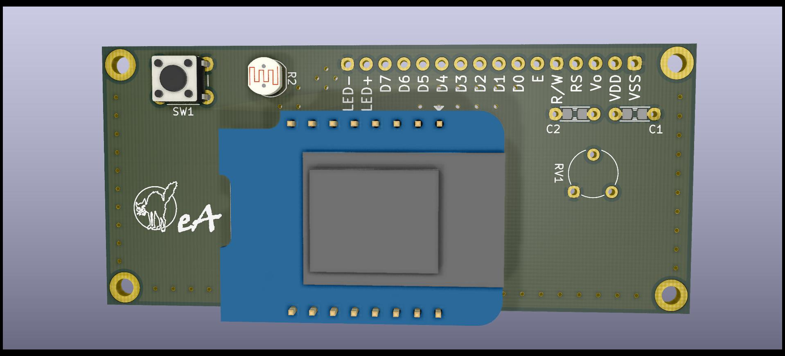
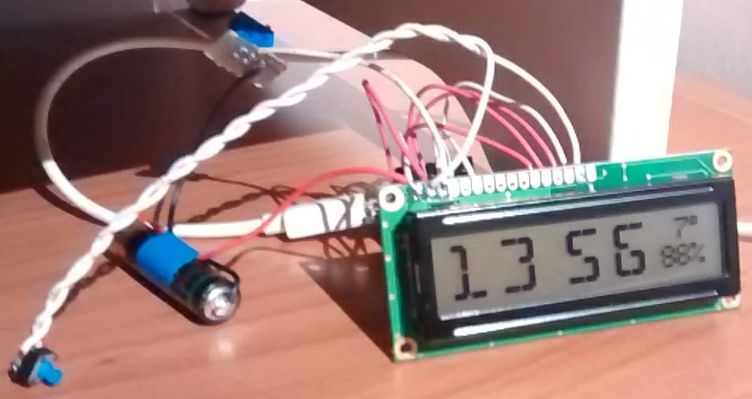
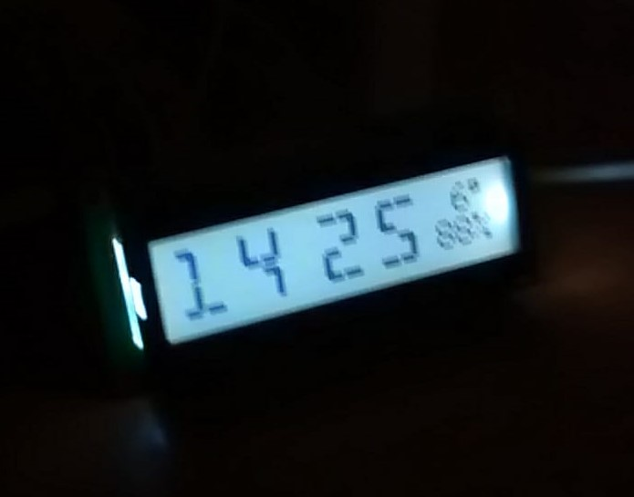

# ESP8266_NTP_clock
Very basic bedside digital clock using the NTP8266 to sync the time using NTP.

## Features

This started as a whish list and expanded during development. Since this is an
open-ended project this list may grow. Never settle!

 * Synchronize time using my local network NTP server
 * Receive and display temperature and humidity readings from my external
   weather station. This way I know at a glance how to get dressed in the
   morning.
 * Backlight support either triggered by a button or automating using a
   photoresistor

## Firmware

**TODO**

## PCB/Mechanical assembly

There's not much to it actually. Just a PCB the same size of the display.
The display board and the control PCB are sandwiched together using M2.5 hex
standoffs. The display conencts to the mainboard using 2.54mm headers.

## Pictures

3D rendering of the PCB:

Prototype (I swear it is not a bomb officer):

